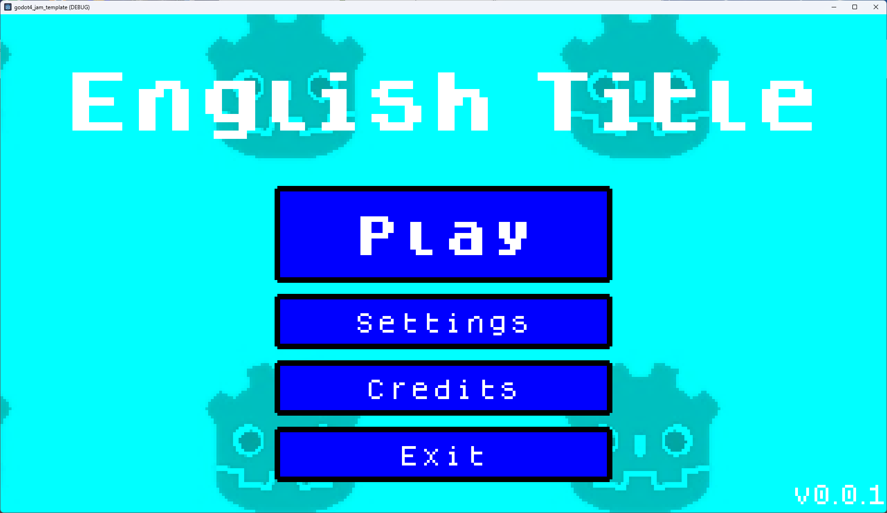
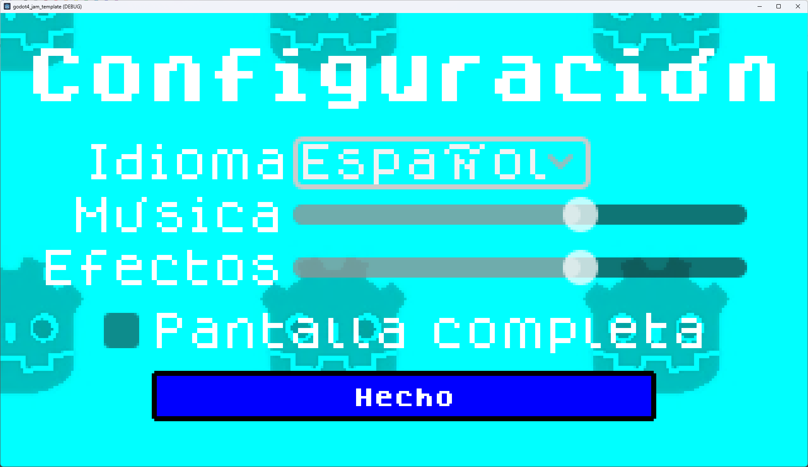

# A template in Godot 4 for game jams

An empty template for a 2d retro-style game (320x180 resolution) with the most common (and boring) things already setup:

* A main menu
* Localization
* Options menu with volume slides, full screen toggle and language selection
* Credits screen
* Pause menu
* Music handling between scenes
* Basic automatic level detection and load, with multiple world support (so more levels can be added dynamically)

## Screenshots

##TODO
* Level transitions
* Music fade outs and ins
* Finishing next level selection/completed level logic
* Defeat/Win screen
* Icons
... (more to come!)

